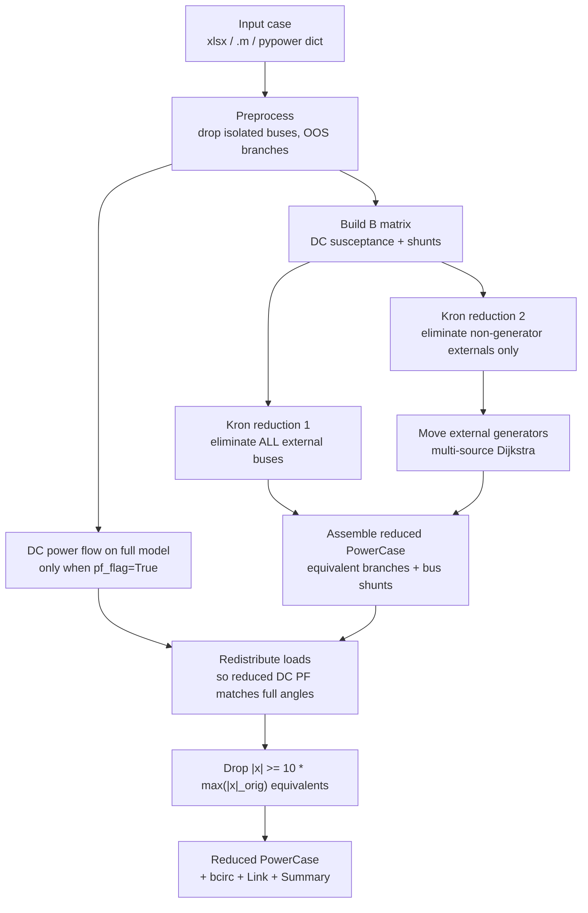

# Algorithm

`simplenet` performs a **DC modified-Ward reduction** of a power system
model. The pipeline matches the MATLAB toolbox in
[`/matlab/NetworkReduction2/MPReduction.m`](https://github.com/IMMM-SFA/simplenet/blob/main/matlab/NetworkReduction2/MPReduction.m)
step for step, but uses an idiomatic
[Kron reduction](https://en.wikipedia.org/wiki/Kron_reduction) for the
core math (see [MATLAB Comparison](matlab-comparison.md) for the
rationale).

## Pipeline



## 1. Preprocess

Implemented in [`simplenet.preprocess`][simplenet.preprocess.preprocess].
Drops:

- Isolated buses (`type == 4`).
- Out-of-service branches (`status == 0`).
- Branches touching isolated buses.
- Generators on isolated buses.
- HVDC lines touching isolated buses.

The external bus list is filtered to exclude any newly removed buses.

## 2. Build the susceptance matrix

For the DC Ward reduction we use the bus-susceptance matrix `B` with:

- Off-diagonal `B[i, j] = -1 / x` for every branch between buses `i`
  and `j` (parallel branches summed).
- Diagonal `B[i, i] = (sum of 1/x for branches at i) + (sum of b/2 for
  branch shunts at i) + (Bs_i / baseMVA)` where `Bs_i` is the original
  bus shunt.

Note that for the **reduction step** we ignore branch tap ratios (this
matches `Initiation.m` exactly &mdash; the tap is reinstated for DC PF and
load redistribution).

## 3. Identify boundary buses

A *boundary* bus is a retained bus that shares at least one branch with
an external bus.

```python
boundary = find_boundary_buses(case, external_bus_ids)
```

Only entries between boundary buses can become equivalent branches in
the reduced model.

## 4. Kron reduction (the math)

Partition the bus set into *external* (`e`) and *internal* (`i`) buses.
Block-decompose `B` and `theta`:

\[
\begin{bmatrix} B_{ii} & B_{ie} \\ B_{ei} & B_{ee} \end{bmatrix}
\begin{bmatrix} \theta_i \\ \theta_e \end{bmatrix}
=
\begin{bmatrix} P_i \\ P_e \end{bmatrix}
\]

Solving the second row for `theta_e` and substituting into the first
row gives

\[
B_{\text{red}} \, \theta_i
\;=\; P_i \;-\; B_{ie} \, B_{ee}^{-1} \, P_e
\quad \text{where} \quad
B_{\text{red}} \;=\; B_{ii} \;-\; B_{ie}\, B_{ee}^{-1}\, B_{ei}.
\]

[`kron_reduce`][simplenet.kron.kron_reduce] computes this with a
single `scipy.sparse.linalg.spsolve` call. The reduced matrix
`B_red` is dense (size `n_internal x n_internal`), which is typically
much smaller than `B`.

## 5. Extract equivalent branches

For each pair of boundary buses `(i, j)` with `i < j`:

\[
\Delta_{ij} \;=\; B_{\text{red}}[i, j] \;-\; B_{ii}^{\text{orig}}[i, j]
\]

If `|Delta_ij| > 1e-12` the reduction introduced a new admittance
between `i` and `j`; we add an equivalent branch with

\[
x_{\text{eq}} \;=\; -\, \frac{1}{\Delta_{ij}}
\]

and circuit number `99` (or a larger sentinel if any original branch
already used `99`, computed as
`max(99, 10**ceil(log10(max_orig_BCIRC - 1)) - 1)`).

## 6. Compute bus shunts

The reduced bus shunt at bus `i` absorbs both the original bus shunt
and all branch-shunt contributions that the Kron reduction folded into
the diagonal:

\[
B_{s,\text{new}}[i] \;=\;
\Big( B_{\text{red}}[i, i] \;-\; \sum_{(i, j) \in \text{reduced branches}} \frac{1}{x_{ij}} \Big) \, \times \, \text{baseMVA}.
\]

Branch shunts on the reduced model are zeroed (`branch[:, 4] = 0`)
because their contribution now lives on the bus.

## 7. Second reduction + generator placement

External generators sit on buses that the first reduction eliminates.
To find where they should "move to", we run a **second** Kron reduction
that retains external generator buses (eliminating only external buses
*without* a generator). The resulting graph has every external generator
still connected to the internal network through a chain of branches.

[`move_external_generators`][simplenet.generators.move_external_generators]
then:

1. Collapses parallel branches via inverse-sum (so the multi-graph
   becomes simple).
2. Builds a sparse weighted graph with edge weights `|x|` (or
   `sqrt(r^2 + x^2)` if `ac_flag=True`).
3. Runs `scipy.sparse.csgraph.dijkstra(..., min_only=True)` from the
   *true internal* bus set as multi-source.
4. Reads off `sources[k]` &mdash; the closest internal bus &mdash; for every
   external-with-generator bus.

The first column of the reduced `gen` matrix is then overwritten with
this mapping, which is what `mpcreduced.gen(:,1) = NewGenBus` does in
MATLAB.

## 8. Load redistribution

After step 7 the reduced model still has the original `Pd` values. A
DC power flow on the reduced model would not match the full-model
solution. [`redistribute_loads`][simplenet.redistribute.redistribute_loads]
fixes that:

1. Run a DC PF on the full model (`pf_flag=True`) or reuse the
   existing `Va` column (`pf_flag=False`).
2. For each retained bus copy `Vm` and `Va` from the full solution.
3. Build the reduced DC PF matrix `B_r` (this one *does* include tap
   ratios, matching the original `LoadRedistribution.m`).
4. Compute the per-bus injection vector `P_inj = B_r * theta * baseMVA
   + P_shift` (phase-shifter contributions added).
5. Set `Pd_new = Pg_total_at_bus - P_inj`.
6. Correct for HVDC line injections at retained bus endpoints.

After this step a DC PF on the reduced model reproduces the retained
buses' angles exactly (modulo the slack-shift; see
[MATLAB Comparison](matlab-comparison.md#dc-power-flow-and-slack-handling)).

## 9. Prune large equivalent branches

The Kron reduction can manufacture equivalent branches whose reactance
is effectively infinite (very weak coupling between two faraway
boundary buses). These add nothing to the model's electrical behavior
and inflate the line count. Following `MPReduction.m`, the pipeline
drops every branch (equivalent or not) with

\[
|x| \;\geq\; 10 \, \times \, \max(|x|_{\text{orig}}).
\]

The threshold is taken before the reduction runs, against the original
branch list.
