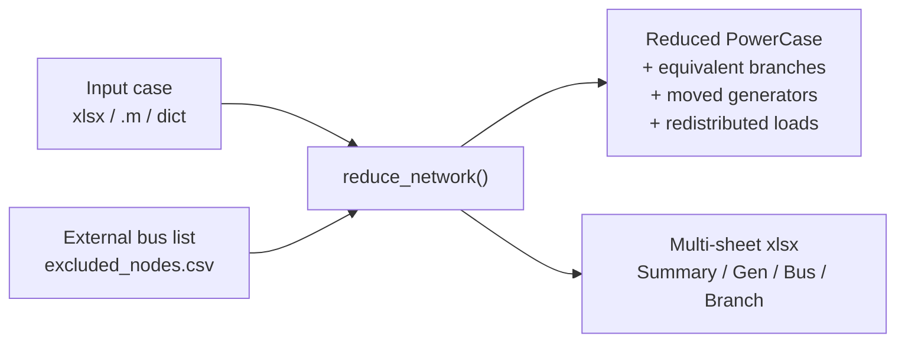

# simplenet

A Python implementation of the [TAMU](https://electricgrids.engr.tamu.edu)
DC modified-Ward network reduction toolbox.

`simplenet` is a from-scratch port of the MATLAB code in
[`/matlab/NetworkReduction2`](https://github.com/IMMM-SFA/simplenet/tree/main/matlab/NetworkReduction2)
(originally by Yujia Zhu, ASU; later adapted by the TAMU group) that:

- Eliminates a user-specified set of *external* buses from a MATPOWER-style
  power-system case.
- Produces an equivalent reduced network with new *equivalent* branches
  between the boundary buses, a bus-shunt adjustment that absorbs all
  branch shunts, and external generators relocated to the nearest
  retained bus by shortest electrical distance.
- Redistributes loads so a DC power flow on the reduced model reproduces
  the full model's bus angles.

It accepts MATPOWER `.m` files, the `matlab2*.xlsx` sheet workbook the
TAMU workflow uses, PSS/E `.RAW` v33 case files (the upstream format
of the ACTIVSg synthetic grids), or in-memory `pypower`-style
dictionaries, and can be driven from Python or from a CLI.

## At a glance



## Why a Python port?

The original MATLAB code requires a MATPOWER installation and license,
has not been updated in several years, and is awkward to integrate into
modern data-science pipelines. `simplenet` replaces the hand-rolled
partial-LU factorization in `PartialSymLU.m` / `PartialNumLU.m` with the
equivalent [Kron reduction](https://en.wikipedia.org/wiki/Kron_reduction)
formula

\[
Y_{\text{red}} = Y_{ii} \;-\; Y_{ie}\, Y_{ee}^{-1}\, Y_{ei}
\]

implemented in `scipy.sparse` &mdash; identical math, but roughly 30 lines
instead of about 1 000 of self-referential link bookkeeping, and an
order of magnitude faster on the 10 000-bus WECC test case.

See [MATLAB Comparison](matlab-comparison.md) for a per-module
walkthrough of what changed and why.

## What's in the docs

- [Getting Started](getting-started.md) &mdash; install, the 9-bus
  worked example, and how to point the package at the
  `matlab2_WECC.xlsx` / `matlab2_east.xlsx` workbooks that the TAMU
  workflow uses.
- [Algorithm](algorithm.md) &mdash; the modified-Ward / Kron reduction
  pipeline with diagrams.
- [MATLAB Comparison](matlab-comparison.md) &mdash; a per-module map of
  the original MATLAB code to `simplenet`, the design decisions, and
  any expected behavioral differences.
- [CLI Reference](cli.md) &mdash; the `simplenet` command-line tool.
- [API Reference](api/index.md) &mdash; auto-generated from PEP-257 /
  Google-style docstrings via [`mkdocstrings`](https://mkdocstrings.github.io).

## Quickstart

```python
from simplenet import reduce_network
from simplenet.io import load_m, dump_xlsx

case = load_m("matlab/NetworkReduction2/test_9bus_case.m")
result = reduce_network(case, [1, 5, 8])
print(result.summary)
dump_xlsx(result.reduced_case, "result.xlsx", summary=result.summary)
```

## Citation

If you use `simplenet` in published work, please also cite the original
MATLAB toolbox and the underlying synthetic test systems:

- Y. Zhu and D. Tylavsky, "An Optimization-Based DC-Network Reduction
  Method," *IEEE Trans. Power Systems*, 2018.
- A. B. Birchfield, T. Xu, K. M. Gegner, K. S. Shetye, T. J. Overbye,
  "Grid Structural Characteristics as Validation Criteria for Synthetic
  Networks," *IEEE Trans. Power Systems*, 2017.

## License

BSD-3-Clause. See [LICENSE](https://github.com/IMMM-SFA/simplenet/blob/main/LICENSE).
